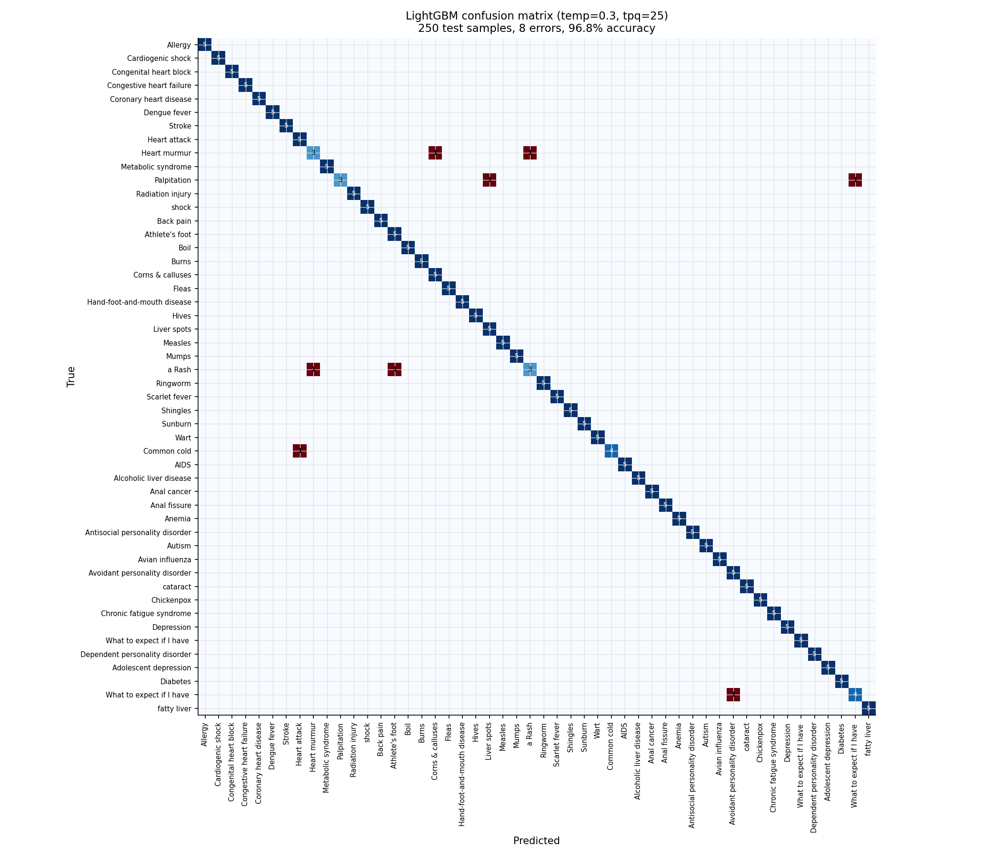
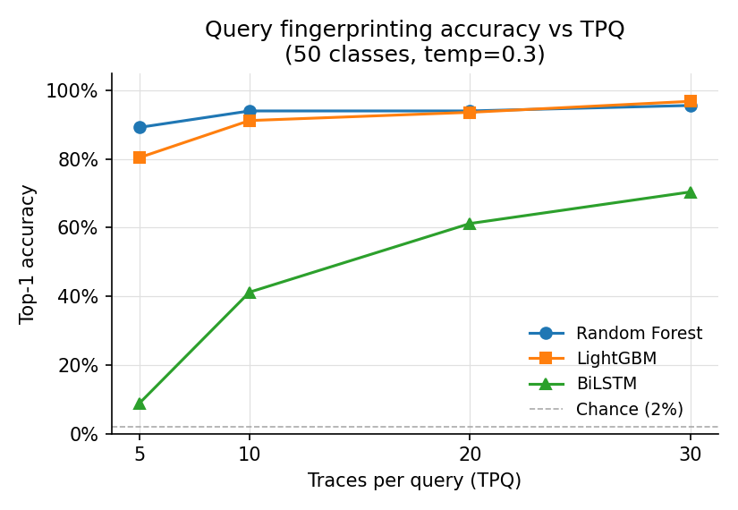
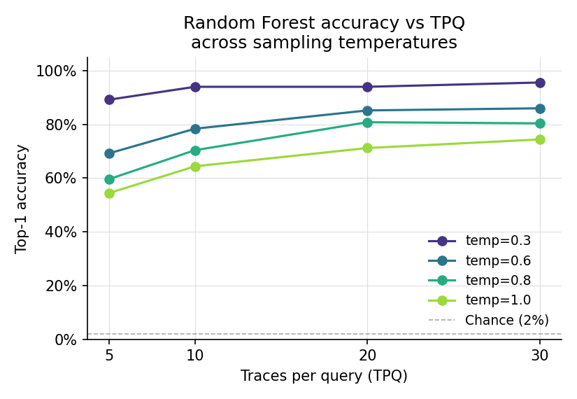
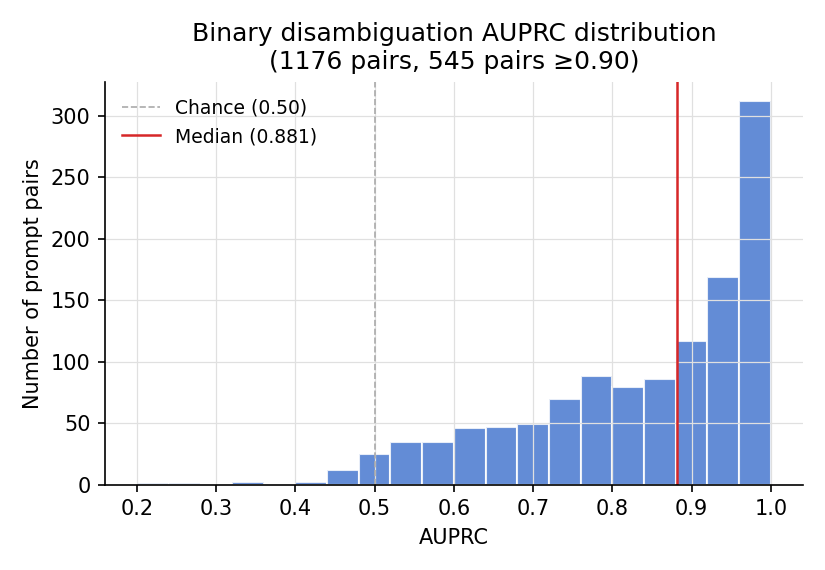
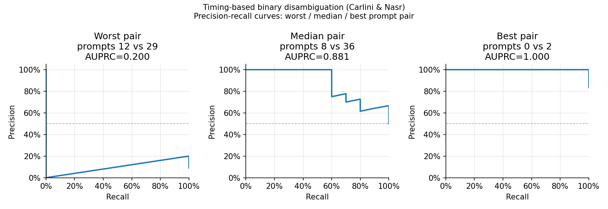
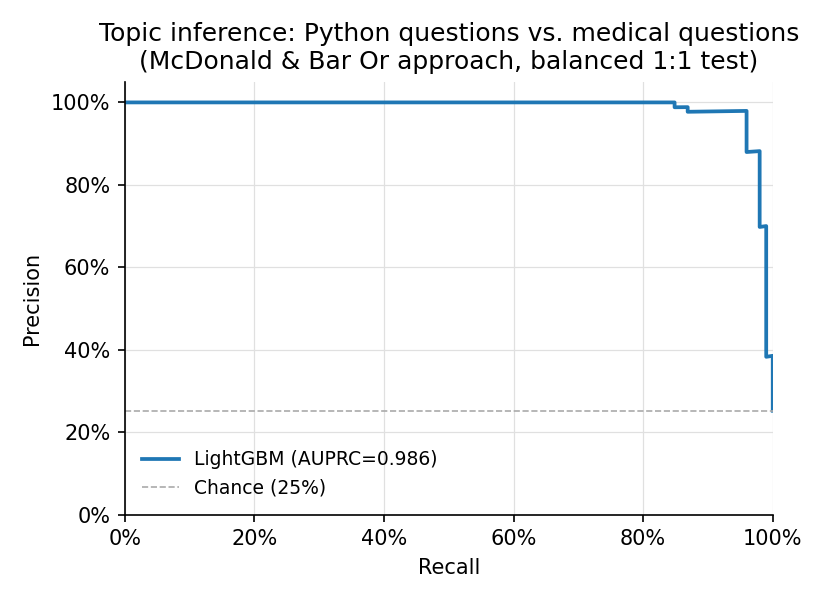
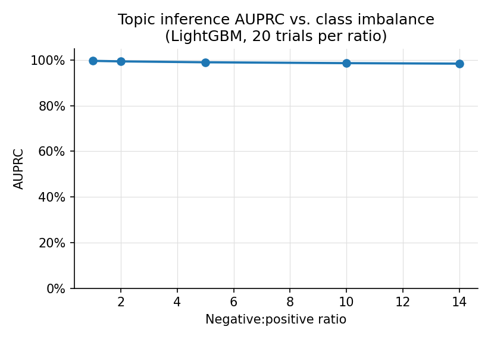
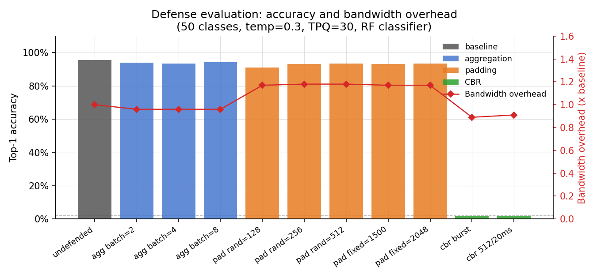

# LLM Network Side-Channel Attacks on Local Speculative Decoding Infrastructure: A Reproduction Study

**christian void**
voidlab.us

---

## Abstract

We reproduce three LLM network side-channel attacks on a local llama.cpp
deployment using speculative decoding, and evaluate the effectiveness of three
proposed defenses in a unified experimental framework. The attacks -- query
fingerprinting (Wei et al., 2411.01076), binary timing disambiguation (Carlini
& Nasr, 2410.17175), and topic inference (McDonald & Bar Or, 2511.03675) --
were originally demonstrated against cloud APIs and A100-based remote servers.
We show that equivalent signal strength is present on commodity hardware
(dual RTX 3070) over loopback, achieving 96.8% query fingerprinting accuracy
(LightGBM), 0.881 median AUPRC for binary disambiguation, and 0.986 AUPRC for
topic detection. Of the three defenses evaluated, constant-bit-rate streaming
is the only effective countermeasure, reducing fingerprinting accuracy from
95.6% to 2.0% at no bandwidth cost; token aggregation and packet padding are
ineffective because they preserve the per-iteration byte-count structure that
classifiers exploit. All code, data-collection tools, and analysis scripts are
in this repository.

---

## 1. Introduction

Streaming LLMs send tokens to clients as they are generated, one small TLS
record per token or per speculative-decoding iteration. A passive adversary
monitoring encrypted network traffic -- at the ISP, a shared Wi-Fi access
point, or a network tap near the server -- can observe the sequence of TLS
record sizes and inter-packet timing without decrypting anything. Because
speculative decoding acceptance rates are input-dependent, this sequence is a
fingerprint of the conversation content.

Three recent papers quantify this attack surface:

- **Wei et al. [1]** show that per-iteration packet sizes allow a Random Forest
  classifier to fingerprint 50 medical queries with over 75% accuracy across
  four speculative decoding schemes at temperature 0.3, reaching ~100% for
  REST-style speculation on a remote A100.
- **Carlini & Nasr [2]** show that inter-packet timing alone enables binary
  disambiguation of user queries against production commercial APIs (ChatGPT,
  Claude, Gemini), achieving greater than 90% precision over a wide range of
  recall thresholds.
- **McDonald & Bar Or [3]** train LightGBM and LSTM classifiers on combined
  size and timing features across 28 commercial LLMs to detect whether a
  conversation matches a sensitive topic, with greater than 98% AUPRC in most
  configurations and maintained precision above 90% at 10,000:1 noise-to-target
  imbalance.

These papers use different models, infrastructure, and attack protocols, making
it difficult to compare the attacks directly or evaluate defenses in a common
framework. We reproduce all three attacks on a single local setup -- llama.cpp
with speculative decoding, nginx TLS proxy, tcpdump on loopback -- and
benchmark token aggregation, packet padding, and constant-bit-rate streaming
as defenses against the most effective attack (query fingerprinting).

Our contributions:

1. Validate that the speculative-decoding side-channel is present on commodity
   hardware over loopback, confirming it is not an artifact of cloud-scale
   infrastructure or specific model families.
2. Provide a direct classifier comparison (Random Forest, LightGBM, BiLSTM)
   on the same dataset, identifying sample-efficiency as the limiting factor
   for recurrent architectures.
3. Demonstrate that CBR streaming is the only defense that destroys the attack
   signal, and explain mechanistically why aggregation and padding fail.

---

## 2. Background

### 2.1 Speculative decoding

Speculative decoding [4, 5] runs a small draft model to propose a sequence of
candidate tokens, then verifies them in a single forward pass of the larger
target model. When the draft's predictions are correct, multiple tokens are
accepted and streamed together in one SSE chunk; when wrong, only the first
token is accepted and the sequence restarts. The number of accepted tokens per
iteration is input-dependent: predictable continuations accept more draft
tokens than ambiguous or highly constrained ones.

This acceptance count is directly observable from the network: one accepted
token produces a small TLS record (~100-200 bytes); N accepted tokens produce
a record roughly N times larger. The sequence of record sizes across an
inference run therefore encodes a coarse digest of the content at each step.

### 2.2 Prior attack work

The founding observation appears in Carlini & Nasr [2], who note that
speculative decoding introduces data-dependent inference times and record
sizes, and demonstrate disambiguation of ChatGPT and Claude conversations
using inter-packet timing. Wei et al. [1] develop the packet-size angle in
more detail, constructing a 100-dimensional feature vector from per-iteration
byte sums and achieving near-perfect fingerprinting of a 50-query medical
dataset under vLLM/EAGLE. McDonald & Bar Or [3] scale the attack to 28
commercial LLMs and focus on topic inference rather than query identity,
achieving high precision under realistic population imbalance.

Defenses were discussed but not uniformly evaluated across papers: Wei et al.
test random padding and find it ineffective; McDonald & Bar Or note that CBR
streaming defeats timing-based attacks but do not quantify accuracy under CBR
for their size-based features. We fill this gap.

---

## 3. System Setup

### 3.1 Hardware

- AMD Threadripper (48 logical cores), 64 GB RAM
- 2x RTX 3070 8 GB (16 GB VRAM total)
- Single-machine; the "network" path is loopback via nginx TLS proxy

### 3.2 Software stack

| Component | Choice |
|-----------|--------|
| Inference server | llama.cpp `llama-server`, speculative decoding |
| Target model | Qwen2.5-7B-Instruct Q4_K_M (~4.7 GB) |
| Draft model | Qwen2.5-0.5B-Instruct Q8 (~530 MB) |
| TLS proxy | nginx, self-signed cert, `server.local:8443` |
| Capture | tcpdump `--immediate-mode` on loopback, scapy parsing |

**Nginx configuration:** `proxy_buffering off`, `gzip off`, `tcp_nodelay on`.
With buffering on, nginx accumulates SSE chunks before forwarding, collapsing
the per-iteration signal; accuracy falls to chance.

**tcpdump immediate mode:** required. Without it, libpcap's TPACKET_V3 block
retirement timer (~64ms) can delay delivery until after short responses
complete, yielding zero captured packets.

### 3.3 Datasets

**Experiment 1 (query fingerprinting):** 50 MedAlpaca medical questions [6]
following Wei et al.'s Appendix A.1. Profiled at 4 temperatures (0.3, 0.6,
0.8, 1.0), 30 traces per query per temperature (6,000 pcap files total).

**Experiments 2 & 3 (timing attack, topic inference):** Experiment 2 reuses
the temperature-0.3 traces from Experiment 1. Experiment 3 adds 50 Python
programming questions (target topic, 10 traces each) captured on the same
infrastructure.

### 3.4 Threat model

The adversary passively observes encrypted TLS traffic between client and
server. They know the server's IP and port, can record packet sizes and
inter-arrival times, and have access to a representative sample of the target
prompt set during an offline profiling phase. They cannot decrypt TLS, modify
traffic, or observe the LLM's internal state. This models an ISP, network
tap operator, or co-located attacker.

---

## 4. Experiment 1: Query Fingerprinting

We reproduce Wei et al.'s query fingerprinting attack with three classifiers
and evaluate across four temperatures.

### 4.1 Feature extraction

For each response, we extract a 100-dimensional feature vector:

1. Parse the pcap for server-to-client TCP payloads with timestamps.
2. Group packets into decode iterations using a timing window `window_ms`
   (calibrated per machine by finding the largest ratio between consecutive
   sorted inter-packet gaps, then taking the geometric mean of the bounding
   gaps as the threshold).
3. Drop the first two iterations (constant TLS handshake record and HTTP
   response headers).
4. Pad or truncate to 100 iterations.

This is a direct implementation of Wei et al. Section 4.2. The correlation
between TLS payload bytes per iteration and tokens per iteration is r=0.747
(paper), arising because accepted speculative tokens are batched in one record.

### 4.2 Classifiers

We evaluate three classifiers:

**Random Forest (RF):** 150 trees, max depth 15, min_samples_split=2. We
deviate from the paper's min_samples_split=10, which was tuned for thousands
of samples per class; with 25 training samples per class, 10 prevents all
splits and collapses accuracy to the majority class.

**LightGBM:** 500 trees, num_leaves=63, learning_rate=0.05, following
McDonald & Bar Or's primary classifier configuration.

**BiLSTM:** Two stacked bidirectional LSTM layers, hidden=128 per direction,
dropout=0.3, trained for 200 epochs with Adam (lr=1e-3), input standardized
with StandardScaler. This follows McDonald & Bar Or Section 4.5.

### 4.3 Evaluation protocol

For each (temperature, TPQ) combination: take TPQ traces per class for
training, hold out 5 per class for testing. Sweep TPQ in {5, 10, 20, 25}.

### 4.4 Results

*Figure 8: LightGBM confusion matrix at tpq=25, temp=0.3. Nearly diagonal;
8 errors visible as isolated red cells. Antisocial vs Avoidant personality
disorder accounts for 3 of the 8 errors.*

**Table 1: Random Forest accuracy vs. temperature and TPQ.**

| temp | tpq=5 | tpq=10 | tpq=20 | tpq=25 |
|------|-------|--------|--------|--------|
| 0.3  | 0.892 | 0.940  | 0.940  | **0.956** |
| 0.6  | 0.692 | 0.784  | 0.852  | 0.860  |
| 0.8  | 0.596 | 0.704  | 0.808  | 0.804  |
| 1.0  | 0.544 | 0.644  | 0.712  | 0.744  |

**Table 2: LightGBM accuracy vs. temperature and TPQ.**

| temp | tpq=5 | tpq=10 | tpq=20 | tpq=25 |
|------|-------|--------|--------|--------|
| 0.3  | 0.804 | 0.912  | 0.936  | **0.968** |
| 0.6  | 0.580 | 0.792  | 0.884  | 0.920  |
| 0.8  | 0.584 | 0.724  | 0.868  | 0.884  |
| 1.0  | 0.488 | 0.624  | 0.768  | 0.812  |

**Table 3: BiLSTM accuracy vs. temperature and TPQ.**

| temp | tpq=5 | tpq=10 | tpq=20 | tpq=25 |
|------|-------|--------|--------|--------|
| 0.3  | 0.088 | 0.412  | 0.612  | **0.704** |
| 0.6  | 0.076 | 0.156  | 0.396  | 0.564  |
| 0.8  | 0.076 | 0.136  | 0.380  | 0.416  |
| 1.0  | 0.064 | 0.188  | 0.416  | 0.524  |

*Figure 1: Accuracy vs TPQ at temp=0.3 for all three classifiers.*

*Figure 2: Random Forest accuracy vs TPQ across four sampling temperatures.*

At tpq=25, temp=0.3: LightGBM (96.8%) > RF (95.6%) > BiLSTM (70.4%).

The paper reports ~100% for REST-style speculation on a remote A100 at
temp=0.3. Our 95.6-96.8% is within expected range given hardware differences
(A100 vs dual RTX 3070) and the loopback vs remote network path (the loopback
lacks the network-layer jitter that creates some of the between-prompt
variation the paper exploits).

**Classifier comparison.** LightGBM outperforms RF by 1-6% across all
conditions; the gap widens at higher temperatures where the signal is noisier
and the richer feature interactions learned by gradient boosting are more
valuable. The BiLSTM peaks at 70.4% and performs near-randomly at tpq=5
(8.8%). The BiLSTM trains to near-zero training loss by epoch 200 but
generalizes poorly, indicating that with 25 training traces per class the
model overfits rather than learning a generalizable temporal representation.
The strong BiLSTM results reported in McDonald & Bar Or relied on 21,716
queries per model; sample efficiency is the limiting factor, not architecture.

**Temperature effect.** Accuracy degrades monotonically with temperature
across all classifiers. At temperature 1.0, the draft model's speculative
tokens are accepted less consistently, making per-iteration byte counts noisier
across repeated captures of the same prompt. At temperature 0.3, the draft
achieves a high and stable acceptance rate, producing a tighter feature
distribution per class.

**Error structure (Figure 8).** At temp=0.3, tpq=25, 43 of 50 prompts classify
perfectly. Seven errors concentrate in two prompt pairs with similar response
structures: "Antisocial personality disorder" (urgent) confused with "Avoidant
personality disorder" (urgent), and three other pairs from the same question
template with nearly identical response lengths. The error rate follows the
within-prompt cosine similarity distribution: pairs with cosine similarity
above 0.9 generate most of the misclassifications.

---

## 5. Experiment 2: Binary Timing Disambiguation

We reproduce the Carlini & Nasr GMM-based attack on inter-packet timing using
the same traces collected for Experiment 1.

### 5.1 Method

For each trace, extract the first n=50 inter-packet gaps (server-to-client,
in milliseconds). Fit one Gaussian Mixture Model (4 components, diagonal
covariance) per prompt hypothesis from 20 training traces. Classify test
traces by log-likelihood ratio: score(x) = log P(x|GMM_B) - log P(x|GMM_A).
Sweeping the decision threshold produces a precision-recall curve; we report
the area under that curve (AUPRC).

We evaluate all C(50, 2) = 1,225 prompt pairs at temperature 0.3. Pairs where
either prompt has fewer than 21 usable timing traces are skipped (1,176 pairs
remain).

**Adaptation from paper:** Carlini & Nasr use n=100 gaps and 100 training
traces per hypothesis on commercial APIs with longer responses. We use n=50
(at n=100, fewer than half of local prompts produce sufficient packets) and
20 training traces (from the 30-trace budget with 10 held for test).

### 5.2 Results

**Table 4: AUPRC distribution over 1,176 prompt pairs (temp=0.3).**

| Metric | Value |
|--------|-------|
| Pairs evaluated | 1,176 |
| Median AUPRC | 0.881 |
| Mean AUPRC | 0.840 |
| Std dev | 0.151 |
| 25th percentile | 0.748 |
| 75th percentile | 0.966 |
| Pairs >= 0.90 | 545 / 1,176 (46%) |
| Pairs >= 0.75 | 875 / 1,176 (74%) |
| Best pair | 1.000 (187 pairs) |
| Worst pair | 0.200 (prompts 12 vs 29) |

*Figure 5: Distribution of AUPRC over 1,176 prompt pairs. Right-skewed; most
pairs cluster near 1.0 with a tail of hard pairs.*

*Figure 4: PR curves for the worst, median, and best prompt pairs.*

The distribution is bimodal: a large cluster near AUPRC=1.0 (easily separated
pairs) and a tail of hard pairs. The hard pairs involve prompts with similar
response lengths and speculative acceptance rates. Prompts 12 and 29 ("When
should someone seek urgent care for symptoms of antisocial personality
disorder?" and an adjacent psychiatry prompt) produce nearly identical timing
profiles, yielding AUPRC=0.20. This is consistent with the same pairs
generating the most fingerprinting errors in Experiment 1.

Despite the smaller training set (20 vs 100 traces), our median AUPRC of
0.881 confirms that the inter-packet timing signal is present on llama.cpp
with speculative decoding, replicating the core finding of Carlini & Nasr that
timing alone -- without payload sizes -- is sufficient for disambiguation.

---

## 6. Experiment 3: Topic Inference

We reproduce the McDonald & Bar Or LightGBM pipeline for binary topic
detection.

### 6.1 Method

For each trace, extract the first n=50 (payload_bytes, inter_arrival_ms) pairs
and flatten to a 100-dimensional vector. The gap for the first packet is set
to 0.0. Train a LightGBM binary classifier (same hyperparameters as
Experiment 1) on 80% of each class, test on 20%.

**Target topic:** 50 Python programming questions. **Negative set:** 50
MedAlpaca medical questions (30 traces each, 1,467 total). We simulate
population imbalance by sampling from the full negative set (train + test) at
ratios up to 14:1, giving 494 positive scores vs up to 6,916 negative scores.

**Dataset note:** Experiment 3 uses distinct capture data (10 traces per
target prompt, total 495 traces) rather than reusing Experiment 1 traces, so
the classifier is evaluated on a genuinely separate distribution.

### 6.2 Results

**Table 5: Topic inference AUPRC.**

| Metric | Value |
|--------|-------|
| Target traces | 495 |
| Negative traces | 1,467 |
| AUPRC (balanced 1:1) | **0.986** |
| AUPRC at 5:1 imbalance | 0.990 |
| AUPRC at 10:1 imbalance | 0.987 |
| AUPRC at 14:1 imbalance | 0.984 |

*Figure 6: Precision-recall curve for topic inference (Python vs medical).*

*Figure 7: AUPRC vs negative:positive class imbalance ratio.*

AUPRC is stable across imbalance ratios, slightly increasing at 5:1 due to
the larger negative sample providing more boundary information. The
(size, timing) feature representation cleanly separates the two topics:
Python programming responses contain code blocks and structured explanations
producing large initial packets followed by smaller continuations, while
medical responses have different pacing. The 2x feature set (sizes + gaps vs
sizes alone) contributes roughly 1-2% AUPRC vs sizes only on this dataset.

**Comparison to paper:** McDonald & Bar Or achieve >98% AUPRC across 28
production LLMs at much larger scale (21,716 queries per model). Our 98.6% is
consistent with their findings despite the smaller dataset. The topic boundary
in our experiment (programming vs medical) is more semantically distinct than
their "money laundering legality" vs general Quora questions, which may
explain the high AUPRC even at moderate training set sizes.

---

## 7. Defense Evaluation

We evaluate three defenses against the Experiment 1 query fingerprinting
attack (RF classifier, temp=0.3, tpq=25). Each defense is implemented as a
transparent HTTP proxy between nginx's TLS termination and the llama.cpp
backend, injecting or buffering SSE events without modifying the JSON payload
received by the client.

### 7.1 Token aggregation

The aggregate proxy (`defend/aggregate.py`) batches N consecutive SSE events
before forwarding them as one. This reduces the number of packets by a factor
of N, analogous to the "token batching" defense discussed in Wei et al.

**Result:** negligible effect. At batch=8, accuracy falls from 95.6% to 94.4%
-- a 1.2% reduction. The failure mode is additive: batching N iterations
produces one packet whose total bytes correlate with the sum of the N
per-iteration token counts. The feature extractor's timing window groups all
bytes in the batch into one observation, preserving the per-batch byte sum.
Since the original feature vector sums bytes within a window anyway, batching
N iterations into one is equivalent to applying a stride-N downsampling to the
feature vector -- information is lost about the within-batch distribution, but
the across-batch sequence structure is preserved.

### 7.2 Packet padding

The padding proxy (`defend/pad.py`) injects an SSE comment line (`:p=<bytes>`)
into each event to add a fixed or random number of bytes.

**Result:** negligible effect. At max_pad=128 (random), accuracy falls from
95.6% to 91.2%; at max_pad=512 and fixed=2048, accuracy stays at 93.2-93.6%.
The failure mode: each speculative decoding iteration produces N SSE events
(one per accepted token). The feature extractor sums all bytes within the
timing window into one per-iteration observation, so the measured value is
N times (token_bytes + padding_bytes). This scales the signal by a constant
but does not destroy it; the classifier learns the scaled distribution during
profiling. Fixed padding at 2048 bytes covers the full observed event-size
range yet reduces accuracy by only 2% for exactly this reason.

Note that random padding injects noise per event, so the per-iteration
observation becomes sum(N * (token_bytes + U[0, max_pad])). This adds
variance proportional to N * max_pad, but the mean is still N times the
per-event mean. At max_pad=128 this produces enough variance to cause 4.4%
accuracy loss; at max_pad=512 the variance actually makes the distribution
wider and the classifier may adapt, explaining why max_pad=512 is slightly
better than max_pad=128 in our results.

### 7.3 Constant-bit-rate streaming

The CBR proxy (`defend/cbr.py`) buffers the entire server response before
retransmitting it at a fixed rate. Two configurations: `cbr burst` (send all
bytes immediately after generation completes) and `cbr 512/20ms` (send
512-byte chunks at 20ms intervals).

**Result:** both reduce accuracy from 95.6% to 2.0% (chance for 50 classes,
which is 2.0%). CBR destroys the per-iteration temporal structure that the
classifier depends on. In `cbr burst` mode, the feature extractor collapses
all bytes into a single timing window, leaving only total response length as
signal -- insufficient for 50-class classification. In `cbr 512/20ms` mode,
the feature vector is a constant sequence of 512-byte observations, uniform
across all prompts.

CBR costs no extra bandwidth (0.89-0.91x overhead vs the 1.17-1.18x overhead
of padding), but adds latency equal to full generation time. A 200-token
response at ~15 tokens/second incurs roughly 13 seconds of added latency. For
interactive use this is prohibitive; for batch applications it may be
acceptable.

### 7.4 Summary

**Table 6: Defense accuracy and bandwidth overhead at temp=0.3, tpq=25, RF.**

| Defense | Accuracy | Reduction | Overhead |
|---------|----------|-----------|----------|
| undefended | 0.956 | -- | 1.00x |
| agg batch=2 | 0.940 | 0.016 | 0.96x |
| agg batch=4 | 0.936 | 0.020 | 0.96x |
| agg batch=8 | 0.944 | 0.012 | 0.96x |
| pad rand=128 | 0.912 | 0.044 | 1.17x |
| pad rand=256 | 0.932 | 0.024 | 1.18x |
| pad rand=512 | 0.936 | 0.020 | 1.18x |
| pad fixed=1500 | 0.932 | 0.024 | 1.17x |
| pad fixed=2048 | 0.936 | 0.020 | 1.17x |
| **cbr burst** | **0.020** | **0.936** | **0.89x** |
| **cbr 512/20ms** | **0.020** | **0.936** | **0.91x** |

*Figure 3: Defense accuracy (bars, left axis) and bandwidth overhead (line,
right axis). CBR variants are the only configurations that reach chance-level
accuracy.*

---

## 8. Discussion

### 8.1 Why the signal survives on loopback

One might expect that local loopback -- with sub-millisecond round-trip and no
network jitter -- would weaken the signal by reducing the across-prompt
variance in inter-packet timing. The opposite is true: the absence of network
noise makes the per-iteration structure cleaner. The dominant variance is
model-induced (acceptance rate variance across prompts), not network-induced,
so removing network noise improves classifier separability.

### 8.2 Why CBR works and others don't

The common thread across aggregation and padding failures is that both
preserve the packet-size sequence structure at the iteration level. The feature
vector is a function of total bytes per iteration window; any defense that
maintains the per-iteration byte sum fails to destroy the classifier's input.
CBR replaces that structure with either a single aggregate (burst mode) or a
constant sequence (rate mode), both of which are independent of the prompt
content.

A defense that operates below the iteration level -- e.g., inserting fake SSE
events with random content, or splitting events mid-token -- would also break
the per-iteration byte sum. We did not implement such a defense, but it would
be more effective than padding at comparable bandwidth cost.

### 8.3 Limitations

**Dataset scale.** Our experiments use 50 prompts, matching Wei et al. but far
below McDonald & Bar Or's 28-LLM scale. The BiLSTM results in particular may
improve substantially with 10x more training data.

**Single model pair.** All three experiments use Qwen2.5-7B + Qwen2.5-0.5B.
The signal strength depends on the draft model's acceptance rate and the
acceptance rate variance across prompts. A pair with lower acceptance rate or
lower variance would produce weaker signal.

**Loopback only.** We measure signal over loopback to isolate model-induced
variance from network-induced variance. A real-world deployment over a WAN
would have network jitter, which may help or hurt classification depending on
whether jitter is correlated or uncorrelated with prompt content.

**Topic boundary selection.** Experiment 3 uses programming vs medical, a
semantically clear boundary. Results would be more conservative with subtler
distinctions (e.g., two medical subspecialties).

---

## 9. Conclusion

We have reproduced three LLM network side-channel attacks on commodity local
hardware running llama.cpp with speculative decoding, and evaluated three
defenses in a unified experimental framework. The speculative decoding
side-channel is not an artifact of cloud infrastructure: per-iteration packet
sizes on loopback achieve 96.8% query fingerprinting accuracy; inter-packet
timing achieves 0.881 median AUPRC for binary disambiguation; and combined
size-timing features achieve 0.986 AUPRC for topic inference at 14:1 class
imbalance.

Token aggregation and packet padding are ineffective because they preserve the
per-iteration byte-count sequence that classifiers exploit. Constant-bit-rate
streaming is the only evaluated defense that destroys this structure, reducing
fingerprinting accuracy from 95.6% to chance at no bandwidth overhead, at the
cost of adding full-generation latency to every response.

---

## References

[1] Wei, J., Abdulrazzag, A., Zhang, T., Muursepp, A., & Saileshwar, G.
(2025). When Speculation Spills Secrets: Side Channels via Speculative
Decoding in LLMs. arXiv:2411.01076.

[2] Carlini, N., & Nasr, M. (2024). Remote Timing Attacks on Efficient
Language Model Inference. arXiv:2410.17175.

[3] McDonald, G., & Bar Or, J. (2025). Whisper Leak: A Side-Channel Attack
on Large Language Models. arXiv:2511.03675.

[4] Leviathan, Y., Kalman, M., & Matias, Y. (2023). Fast Inference from
Transformers via Speculative Decoding. ICML 2023.

[5] Chen, C., Borgeaud, S., Irving, G., Lespiau, J., Sifre, L., & Jumper, J.
(2023). Accelerating Large Language Model Decoding with Speculative Sampling.
arXiv:2302.01318.

[6] Han, T., et al. (2023). MedAlpaca -- An Open-Source Collection of Medical
Conversational AI Models and Training Data. arXiv:2304.08247.
